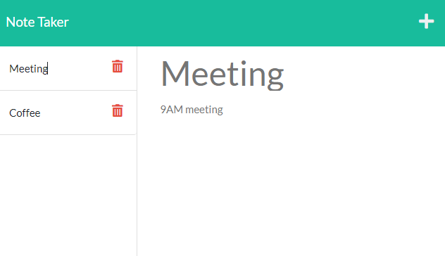

# Note taking software with express [](https://opensource.org/licenses/MIT)

## Description

This allows you to add, delete and view notes. It uses an express server and api requests to persist the data, saving in a JSON file.

Deployed at: \
https://gentle-meadow-26894.herokuapp.com/

Repo on github at: \
https://github.com/jjcourtney/note-taker


## Table of contents

- [Installation](#installation)
- [Usage](#usage)
- [License](#license)
- [Questions](#questions)
- [Languages](#languages)
- [Screenshot](#screenshots)

## Installation
To start the server run ```node server.js```

## Usage
Open the root file on your browser.

## License 
This is covered under The MIT License: 
[](https://opensource.org/licenses/MIT)

## Questions

If you have any questions you can contact me on: 
jcourtneywork@gmail.com

my github:
https://github.com/jjcourtney/

## Languages
 |  | 

## Screenshots

